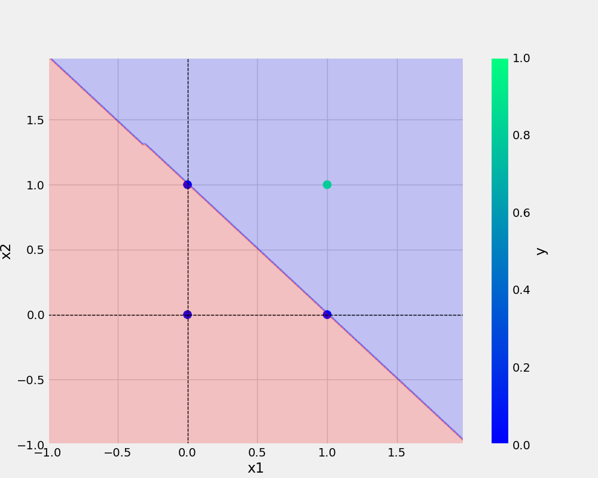

# oneNeuron
oneNeuron/Perceptron

``` bash

git add . && git commit -m " docstring updated" && git push origin main

```

``` bash

cp Research\ Work/demo.ipynb .

```
## add URL -
[Git-Handbook] (https://guides.github.com/introduction/git-handbook/)

## add Image -



## python code

```
def main(data, modelName, plotName, eta, epochs):
    df = pd.DataFrame(data)
    print(df)
    X, y = prepare_data(df)
    model = Perceptron(eta=eta, epochs=epochs)
    model.fit(X, y)
    _ = model.total_loss()
    save_model(model, filename=modelName)
    save_plot(df, plotName, model)
```
## and dataset
x1 | x2 | Y
-|-|-
0|0|0
0|1|1
1|0|1
1|1|1

###
* point
* point 

1. point
2. point


